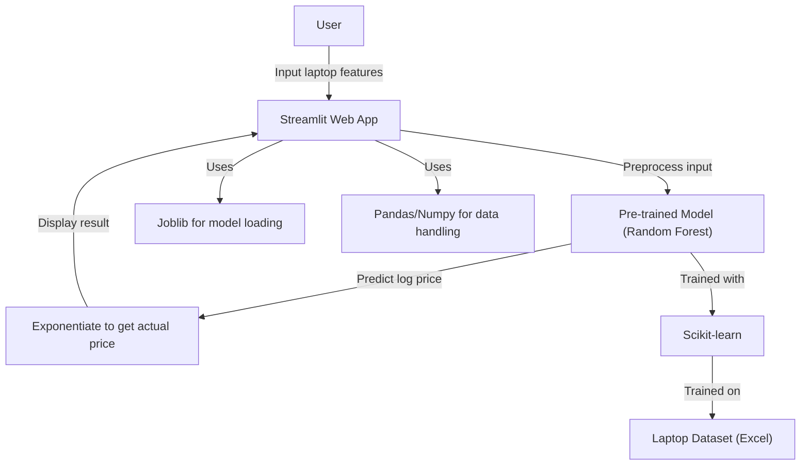

# Laptop Price Predictor

Predict the price of a laptop based on its specifications using a machine learning model trained on real-world data. This project features a user-friendly web interface built with Streamlit, allowing users to input laptop features and instantly receive a price prediction.

---

## 🚀 Features
- Predicts laptop prices based on brand, type, RAM, weight, screen, CPU, storage, GPU, and OS.
- Interactive web app for easy user input and instant results.
- Trained on a real dataset of 1300+ laptops.
- Multiple regression models evaluated; Random Forest chosen for best performance.
- Data preprocessing and feature engineering for accurate predictions.

---

## 🗂️ Project Structure
```
Laptop_price_predictor/
├── app.py                # Streamlit web app
├── price_prediction.ipynb# Data analysis, preprocessing, model training
├── requirements.txt      # Python dependencies
├── laptop_data.xlsx      # Raw dataset
├── pipe.jb               # Trained model (Random Forest)
├── data.jb               # Preprocessed data for app
```

---

## 🛠️ Technologies Used
- **Python**: Core programming language.
- **Pandas & NumPy**: Data manipulation and numerical operations.
- **Matplotlib & Seaborn**: Data visualization.
- **Scikit-learn**: Machine learning model building and evaluation.
- **Streamlit**: Web app framework for interactive UI.
- **Joblib**: Model serialization and loading.
- **Jupyter Notebook**: Exploratory data analysis and model development.

### Technology Descriptions
- **Streamlit**: Turns Python scripts into shareable web apps in minutes.
- **Scikit-learn**: Provides simple and efficient tools for data mining and data analysis.
- **Joblib**: Efficient serialization of large numpy arrays and models.

---

## 📊 Dataset
- **Source**: `laptop_data.xlsx`
- **Rows**: 1303 laptops
- **Features**: Brand, Type, Screen, CPU, RAM, Storage, GPU, OS, Weight, Price
- **Preprocessing**: Cleaned, feature engineered (e.g., PPI, storage types), categorical encoding

---

## 🧠 Model
- **Algorithm**: Random Forest Regressor (best r2 score: ~0.86)
- **Target**: Log-transformed price for better regression performance
- **Pipeline**: Preprocessing + Model (saved as `pipe.jb`)

---

## 🌐 Live Demo
[Live Demo Link](#) <!-- Replace with actual URL if deployed -->

---

## 📦 Installation & Usage
1. **Clone the repository:**
   ```bash
   git clone https://github.com/Saikiranabhi/Laptop_price_predictor.git
   cd Laptop_price_predictor
   ```
2. **Install dependencies:**
   ```bash
   pip install -r requirements.txt
   ```
3. **Run the app:**
   ```bash
   streamlit run app.py
   ```
4. **Open in browser:**
   - Go to the local URL provided by Streamlit (usually http://localhost:8501)

---

## 📝 Usage
- Select laptop features in the sidebar.
- Click **Predict Price** to see the estimated price.

---

## 📈 Workflow Diagram



---

## 📚 Important Notes
- The model predicts prices based on the data it was trained on; results may not generalize to all laptops.
- For best results, deploy using Streamlit Cloud or similar services.
- Large model/data files (`pipe.jb`, `data.jb`) may not be suitable for all deployment environments.

---

## 🔗 GitHub Repository
[https://github.com/Saikiranabhi/Laptop_price_predictor](https://github.com/Saikiranabhi/Laptop_price_predictor)

---

## 🤝 Contributing
Pull requests are welcome! For major changes, please open an issue first to discuss what you would like to change.

---

## 📄 License
This project is licensed under the MIT License. 